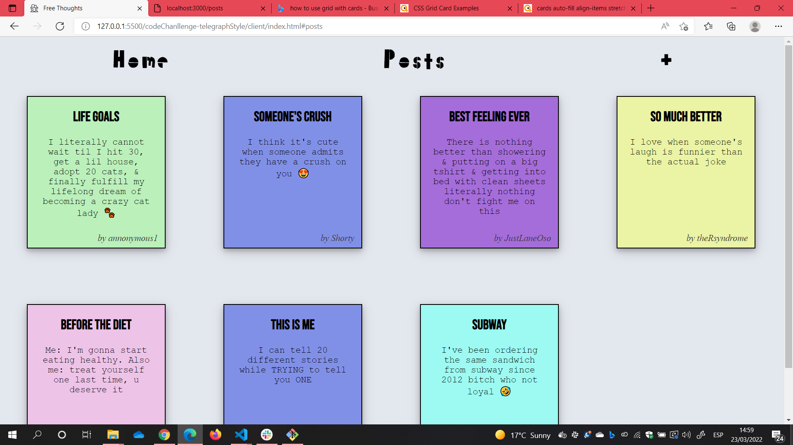
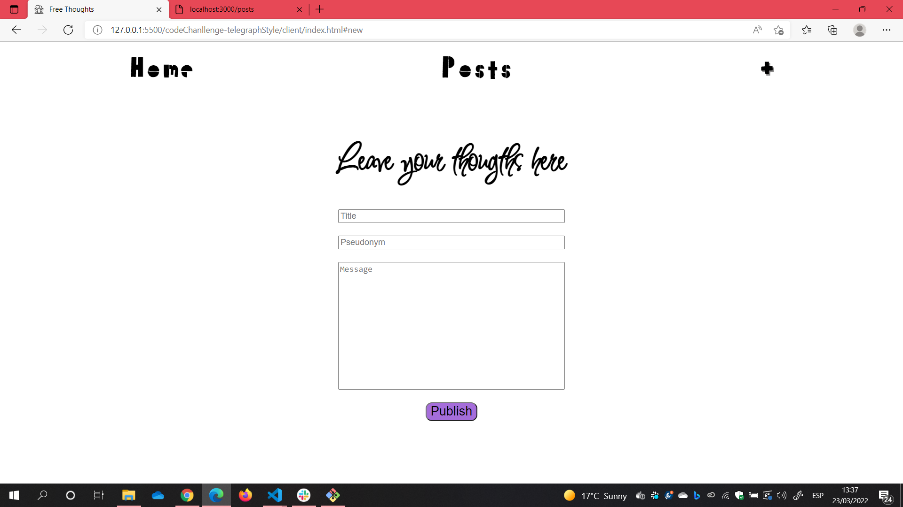

# CODE CHALLENGE

[Michael Nelson](https://github.com/mwezn), [Isabel Repetto](https://github.com/neifors)

## Installation & Usage

- Clone this respository

### CLIENT

- Go to `client` folder and open `index.html` using your browser.
- You can also `Open with Live Server` from VS Code if you have installed the extension.
- It depends on the server so it won't work properly until the server is running

### SERVER

- Using your terminal, go into `server-mongodb` folder and run `docker-compose up`
- This command will install everything you need to run the server and will deploy it at http://localhost:3000/

# HOW CLIENT LOOKS

